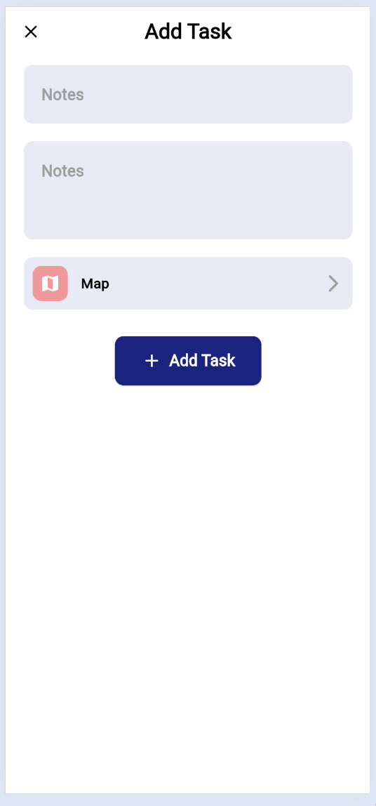
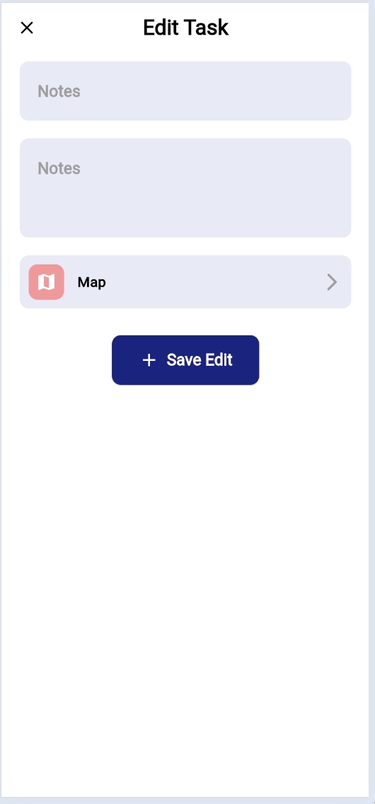

# todo-week1

# 40 week challenge

## Current week
- week 1

## This week's app
- Todo application

## Project Summary

### Completed Tasks

- Todo UI - edit Item
- Todo UI - list of groups
- Todo UI - display item
- Todo UI - create new item
- Todo UI - home
- Setup Environment - github and local
- Todo Wireframe
- Mood board to copy design
- Setup theme
- Color Scheme: Light
- Todo Readme

### Incomplete Tasks

- Todo UI - create groups
- Color Scheme: Dark Mode
- Todo - Isar Crud
- Todo functions - home
- Todo functions - create new item
- Todo functions - create new group
- Todo function - display item

### Lessons Learned: Applying Insights to Future Projects

- Simplify it
- Limit to 3 pages; 1 week is insufficient for 4 pages or more
- Begin with implementing a color scheme change for dark mode configuration to facilitate easier testing in dark mode.
- Aim to reuse code extensively and avoid making formatting additions or edits for improved reference and uniformity.
- Push code to GitHub only when done and not incomplete tasks.
- Add testing automation task

## APK File

## Screen shots

## Additional Images

### Wireframe

### Moodboard

